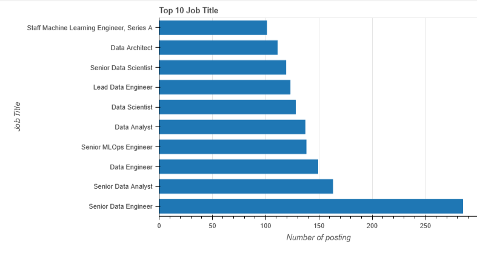
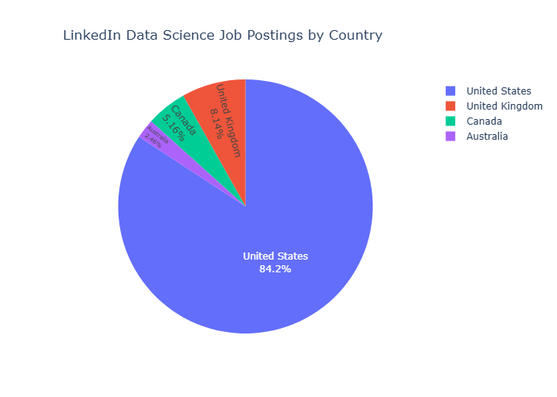
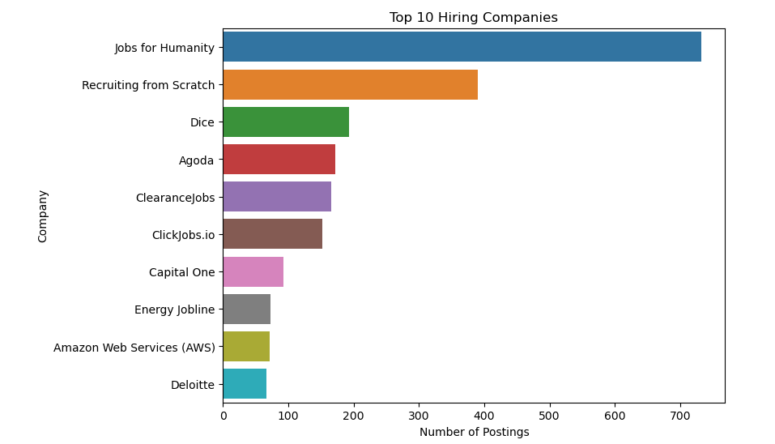
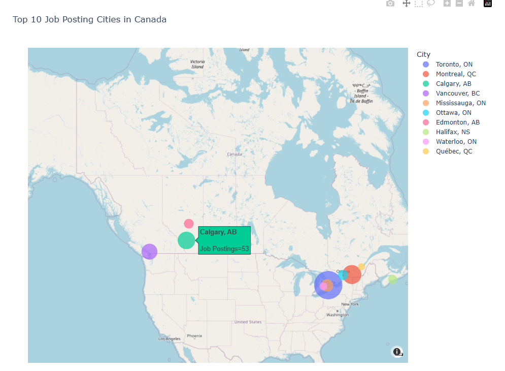
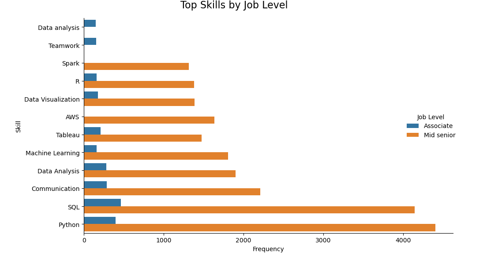

# Data Science Job Market Analysis (January 2024)

**Exploring Data Science Job Postings from LinkedIn across the US, Canada, UK, and Australia**

---

## Project Overview

This project analyzes data science job postings collected from LinkedIn during January 2024 to uncover insights about:

- The most common job titles  
- Top locations for data science roles  
- Most active hiring companies  
- In-demand skills by job level  

The dataset was sourced from Kaggle and includes two files: job postings and associated job skills. The analysis focuses on four countries: United States, Canada, United Kingdom, and Australia.

---

## Dataset

- **job_postings.csv:** Contains details like job titles, company names, job locations, job levels, and timestamps.  
- **job_skills.csv:** Lists in-demand skills for each job posting.

The data reflects LinkedIn job postings related to data science roles as of January 2024.

---

## Tools & Technologies

- Python  
- Jupyter Notebook  
- Pandas for data manipulation  
- Visualization libraries: Bokeh, Seaborn, Plotly, Matplotlib  

---

## Data Preparation & Cleaning

- Merged job_postings and job_skills datasets.  
- Removed irrelevant columns (`got_summary`, `got_ner`, `is_being_worked`, `last_status`).  
- Handled missing and duplicate values.  
- Converted date columns (`first_seen`, `last_processed_time`) to datetime objects.  
- Extracted city names from job_location for geographical analysis.

---

## Key Insights

1. **Popular Job Titles:**
   
   
   
   Senior Data Engineer, Senior Data Analyst, and Data Engineer roles were most frequently posted.

3. **Job Postings by Country:**

   
   
   84% of job postings originated from the United States, followed by the United Kingdom, Canada, and Australia.

5. **Top Hiring Companies:**

   
   
   A mix of startups (Jobs for Humanity, Recruiting from Scratch) and established companies (Dice) dominate hiring.

7. **Active Canadian Cities:**

   
   
   Toronto, Montreal, and Calgary are the top Canadian cities for data science jobs.

9. **In-Demand Skills by Job Level:**

   
   Python, SQL, and Communication skills lead for Associate and Mid-Senior roles, with Tableau and Machine Learning also in demand.

---

## Conclusions

- The data science job market is dominated by roles in data analysis, engineering, and science, with the US as the largest market.  
- Both startups and large corporations actively hire data professionals.  
- Canadian cities show strong demand for data science talent.  
- Technical and communication skills are crucial across job levels.

---

## Repository Contents

- `job_postings.csv` — Original job postings data  
- `job_skills.csv` — Skills related to job postings  
- `data_science_job_posting.ipynb` — Jupyter Notebook with all data cleaning, analysis, and visualizations  
- `README.md` — Project overview and documentation

---

## How to Run

1. Clone this repository.  
2. Open `data_science_job_posting.ipynb` in Jupyter Notebook.  
3. Ensure dependencies are installed:  
   ```bash
   pip install pandas matplotlib seaborn plotly bokeh

## References
Dataset from Kaggle: Data Science Job Postings & Skills (2024)

Link : https://www.kaggle.com/datasets/asaniczka/data-science-job-postings-and-skills

Data source: LinkedIn job postings

## Author

Yasmina Barkouch — Data Analyst Enthusiast

LinkedIn Profile :www.linkedin.com/in/yasminabarkouch


